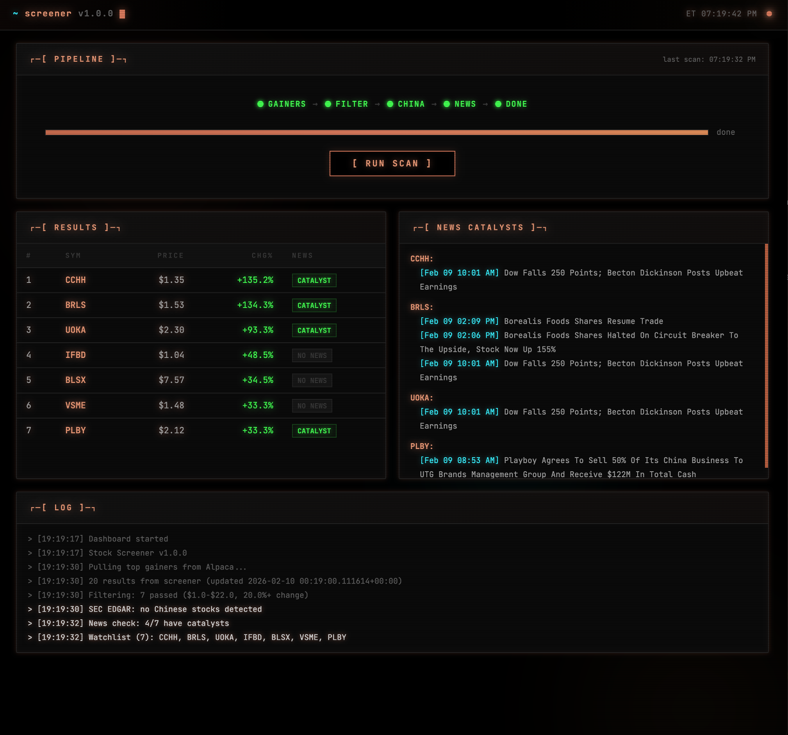

<p align="center">
  
</p>

<p align="center">
  
  
  
  
</p>

<p align="center">
  <code>Real-time stock screener that surfaces high-momentum gainers with real catalysts.</code><br/>
  <code>Filters warrants, Chinese shells, and noise. Built for premarket.</code>
</p>

<p align="center">
  
</p>

---

### `>_ PIPELINE`

| Stage | Method | Source |
|:------|:-------|:-------|
| **Alpaca Screener** | Pull top 20 gainers | Alpaca Markets API |
| **Price/Change Filter** | `$1-$22`, `20%+` move | Screener data |
| **Warrant Exclusion** | Regex on suffix `WS\|WT\|PR\|U\|R` | Ticker symbol |
| **SEC EDGAR China Filter** | Biz address `AND` incorporation | SEC EDGAR API |
| **News Catalyst Check** | 48h lookback, filters roundups | Alpaca News API |
| **Final Watchlist** | Symbols that pass all filters | -- |

---

### `>_ USAGE`

```bash
# scan — top gainers with all filters applied
python3 screener.py

# adjust thresholds
python3 screener.py --min-change 30 --max-price 10

# hard mode — drop anything without a news catalyst
python3 screener.py --news-hard

# fetch 1-month of 1-min historical bars
python3 screener.py --fetch

# skip filters
python3 screener.py --no-china-filter --no-news

# pull more results from the screener
python3 screener.py --top 30
```

<details>
<summary><b>Sample Output</b></summary>

```
======================================================================
  STOCK SCREENER — TOP GAINERS
======================================================================
  Last updated: 2026-02-07 09:22:00-05:00
  Raw results: 20 gainers

  === RAW TOP GAINERS (unfiltered) ===
  #    Symbol      Price   Change%    Change$
  ------------------------------------------------
  1    BRLS      $  1.04    +117.3%  $    0.56
  2    PLBY      $  1.98     +52.3%  $    0.68
  3    HUMA      $  5.22     +38.1%  $    1.44
  4    LIMN      $  2.83     +45.1%  $    0.88

  Checking SEC EDGAR for Chinese stocks...
      BRLS -> OK (A6/DE)
      PLBY -> OK (CA/DE)
  No Chinese stocks detected.

  Checking news catalysts (last 48h)...
      BRLS -> CATALYST  Borealis Foods announces major distribution deal
      PLBY -> CATALYST  Playboy announces restructuring plan
      HUMA -> CATALYST  Humacyte receives FDA breakthrough designation
      LIMN -> NO NEWS   (no company-specific news)

  Watchlist (4): BRLS, PLBY, HUMA, LIMN
```

</details>

---

### `>_ FILTERS`

| Filter | Method | Data Source |
|:-------|:-------|:-----------|
| `PRICE` | `$1.00 – $22.00` configurable | Alpaca Screener |
| `% CHANGE` | `≥ 20%` configurable | Alpaca Screener |
| `WARRANTS` | Regex on suffix `(WS\|WT\|PR\|U\|R)` | Ticker Symbol |
| `CHINA/SHELL` | Biz address `AND` incorporation | SEC EDGAR API |
| `NEWS` | Company-specific headlines only | Alpaca News API |

---

### `>_ SETUP`

```bash
git clone https://github.com/erictidmore/stock-screener.git
cd stock-screener

python3 -m venv venv
source venv/bin/activate
pip install -r requirements.txt

cp .env.example .env
# add your Alpaca API keys to .env
```

> Requires a free [Alpaca Markets](https://alpaca.markets) account.

---

### `>_ DASHBOARD`

```bash
# launch the web dashboard
python3 dashboard.py

# open in browser
open http://localhost:8051
```

CRT-styled web dashboard with real-time pipeline visualization. Runs fully autonomous — autopilot scans at 9:20 AM ET, rescans until market open, resets daily. Breaking news monitor polls for new headlines every 60s and flashes alerts in real-time.

| Feature | Detail |
|:--------|:-------|
| **Autopilot** | 24/7 autonomous — scan @9:20 AM, rescan pre-market, daily reset @8 AM, skip weekends |
| **Breaking News** | Polls Alpaca News API every 60s for watchlist symbols, flashes new headlines |
| **Pipeline Tracker** | Animated stage progression with per-symbol progress |
| **WebSocket** | Real-time state push to all connected clients (1s interval) |
| **CRT Effects** | Scanlines, morphing orbs, flicker, glow, JetBrains Mono |

---

### `>_ STRUCTURE`

```
stock-screener/
├── screener.py       main entry — orchestrates the pipeline
├── dashboard.py      web dashboard — CRT-styled FastAPI server
├── filters.py        warrant · china · news · price filters
├── fetch.py          historical 1-min bar downloader (SIP)
├── config.py         credentials + filter defaults
├── requirements.txt
└── .env.example      API key template
```

---

### `>_ STACK`

<p>
  
  
  
  
  
</p>

---

<p align="center">
  <sub>MIT License</sub>
</p>
